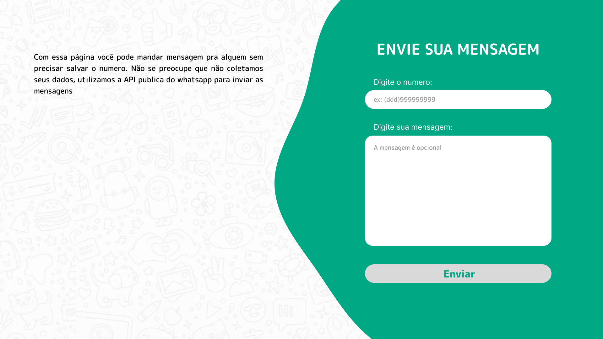

<h1 align="center"> Calculadora de IMC </h1>

  

 

  

## </img> Tecnologias

Esse projeto foi desenvolvido com as seguintes tecnologias:

- HTML e CSS
- JavaScript

## </img> API

- Public whatsapp api

## </img> Projeto

Utiliza a api publica do whatsapp para enviar mensagem sem precisar salvar nenhum numero

 <h3 align="center"> Developed by <a href="https://www.linkedin.com/in/gabriel-santos-bb4a10188/">Gabriel Santos</a> ☕</h3>
